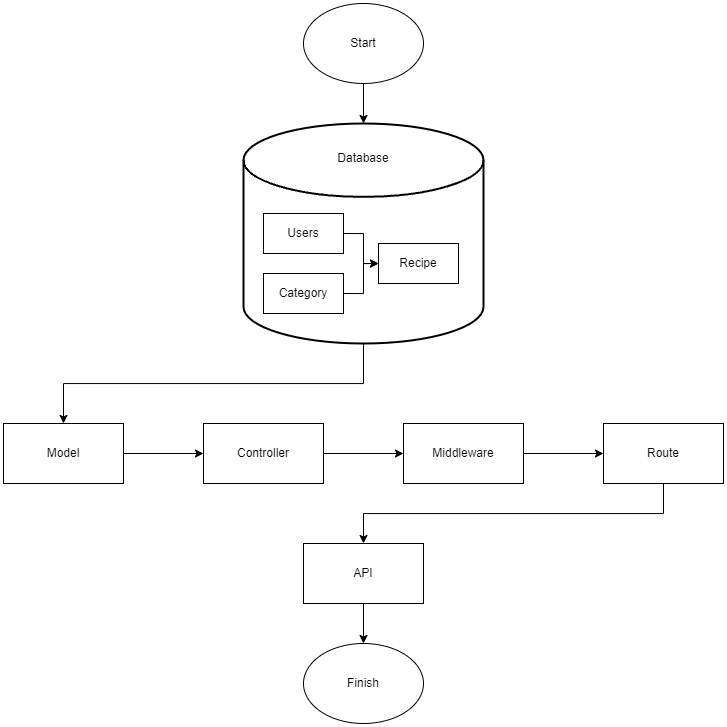

<h1 align="center">Food Recipe API</h1>
Food Recipe API is an API that functions as a Backend containing user, category, and recipe data. This API is built with <a href="https://expressjs.com">ExpressJs</a> which is a simple and flexible web application framework that uses <a href="https://nodejs.org/en/about/">NodeJs<a/>.<br>

<h1 align="center"></h1>

## Requirements
1. <a href="https://nodejs.org/en/">Node Js</a>
2. <a href="https://www.postman.com/downloads/">Postman</a>
3. Database (PostgreSQL or PhpMyAdmin)
4. Server (Localhost or Online Server)
5. <a href="https://cloudinary.com">Cloudinary</a>

## Installation and Usage Steps
1. Open your project directory in CMD or terminal
2. Run command 'npm i' or 'npm install' to download the package on this API
3. Make Cloudinary account to get cloud storage for recipe photo
4. Turn on your server like Xampp for localhost
5. Create database in your database
6. Make new file in your project directory callad '.env' and copy this code to that file :
```
DB_USER=root
DB_HOST=localhost
DB_NAME= //Your Database Name
DB_PASS=
DB_PORT=8080

NODE_ENV=development //If your project still under development, if not you can change to production

JWT_KEY= //Your JWT key or Random Number

EMAIL_NAME= //Your Admin Email
EMAIL_PASSWORD= //Your Admin Email Password

PHOTO_NAME= //Your Cloudinary CLoud Name
PHOTO_KEY= //Your Cloudinary API Key
PHOTO_SECRET= //Your Cloudinary API Secret
```
7. Open Postman, choose HTTP request method and  request URL like localhost:8080/

## API Route
 * '/'
 * '/auth/register' (Registrasi Users)
   '''{"email":"ex@email.com","name":"Bob","password":"test123"}'''
 - http://localhost:4000/auth/login (Login)
 - http://localhost:4000/users (Data Users)
 - http://localhost:4000/users/myProfile (Data Users dari 1 akun)
 
 - http://localhost:4000/category (Data Category)
 
 - http://localhost:4000/recipe  (Data Recipe)
 - http://localhost:4000/recipe/myRecipe  (Data Recipe dari 1 akun)
 - http://localhost:4000/recipe?search=Sate&sortby=created_at&sort=desc&page=1&limit=10 (Data Recipe dengan Filter)
